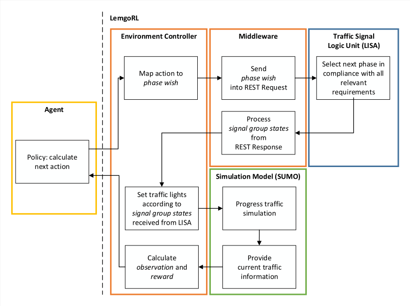
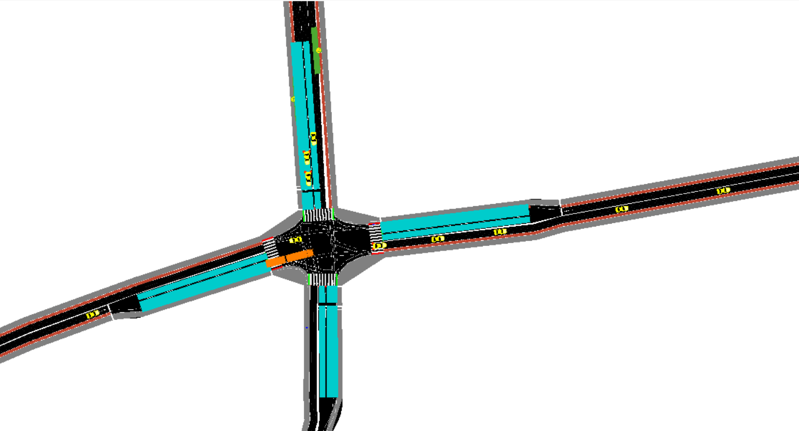
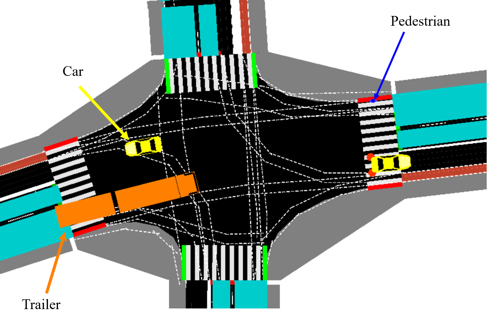
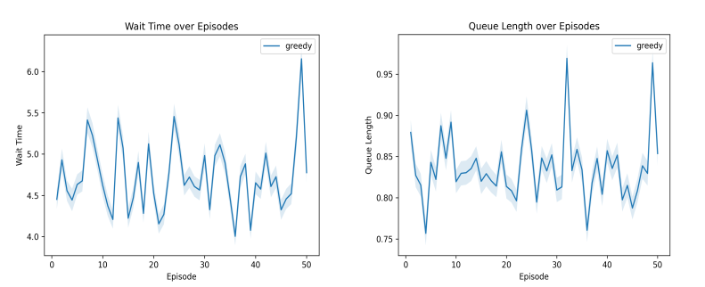
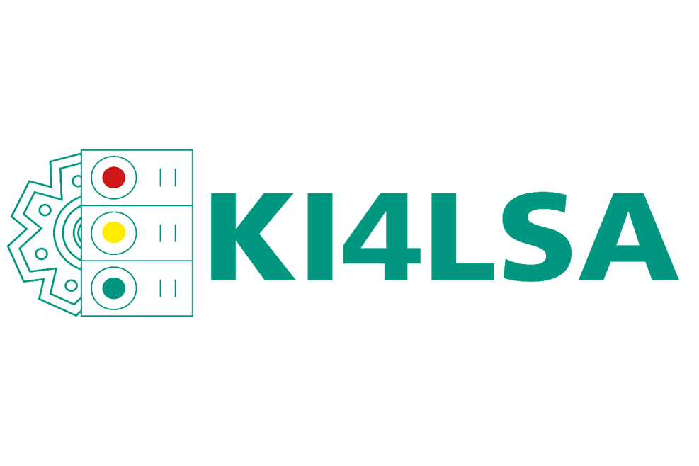
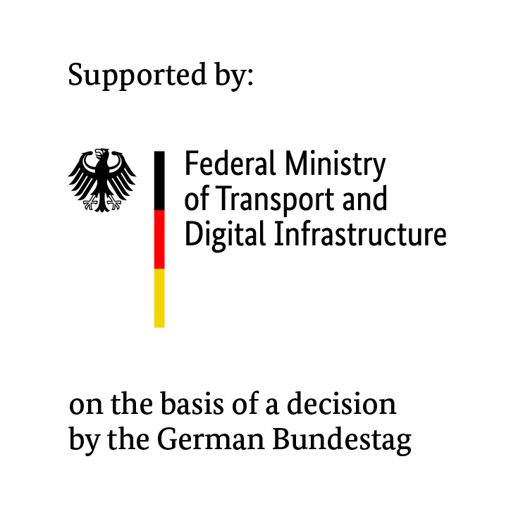

# LemgoRL
[](https://www.youtube.com/watch?v=MNPH1k5h1-g)

LemgoRL is an open-source benchmark tool for traffic signal control designed to train reinforcement learning agents in a highly realistic simulation scenario with the aim to reduce Sim2Real gap. The process diagram of the tool is shown below:



Associated paper is available at: https://arxiv.org/abs/2103.16223

#### Key Features:

- Simulation model of real-world intersection of Lemgo in SUMO (Simulation of Urban MObility)
- Real-world vehicle and pedestrian traffic demand modeling of the intersection
- Traffic Engineering through Traffic Signal Logic Unit ([Lisa+ OmlFgServer](https://github.com/vishalrangras/LemgoRLTemp#omlfgserver-and-traffic-signal-logic-unit))
- OpenAI Gym based environment to train RL Agents
- Middleware to facilitate communication between environment controller and Traffic Signal Logic Unit (TSLU).
- Python based Greedy policy implementation to serve as a base policy
- Evaluation function to plot graphs of queue length, average speed and wait time w.r.t. simulation time and w.r.t. episodes.
- Visualize function to see the graphical simulation of the traffic and control of intersection by greedy policy in SUMO-GUI.

#### OmlFgServer and Traffic Signal Logic Unit

In order for the Traffic Signal Logic Unit to work, the **Lisa+ OmlFgServer.jar** is needed. The Lisa+ OmlFgServer.jar is a proprietary Virtual Controller Server for traffic lights which can be purchased from the company **Schlothauer & Wauer**. Since it is a proprietary product, it cannot be shipped with this LemgoRL open-source repository.

#### Prerequisite

1. Download and install SUMO (Simulation of Urban MObility) for your platform from https://sumo.dlr.de/docs/Downloads.php, if not already installed.
2. Download and install JRE or JDK 8 for your platform from https://www.oracle.com/java/technologies/javase/javase-jdk8-downloads.html, as it is needed by LemgoRL in order to run OmlFgServer.jar.

#### Installation Steps

1. Install Microsoft Visual C++ 14.0 from https://aka.ms/vs/16/release/vc_redist.x64.exe
2. Install Anaconda / Miniconda from https://www.anaconda.com/products/individual
3. In anaconda prompt, execute the command `conda env create -f environment.yml`. This command will create an anaconda environment "LemgoRL".
4. Activate the anaconda environment with the command `conda activate LemgoRL` for Windows or `activate LemgoRL` for Linux/Unix/Mac.
5. Place the OmlFgServer.jar procured from the company **Schlothauer & Wauer** in directory path: `lisa_vissim_addon/59081`.

#### Visualize Mode

This source code comes with `main.py` script as a test script which can be used to launch the LemgoRL simulation model in SUMO-GUI mode and observe the control of intersection by greedy policy. To visualize the greedy policy, following command needs to be executed from the root directory of this project:

`python main.py visualize`

To visualize the PPO Policy with the pretrained checkpoint stored inside `./agents_runs/owl322/PPO`

`python main.py visualize --algo=PPO --checkpoint-nr=530`

The available policies that can be visualized or evaluated are:

1. greedy
2. greedy-wave 
3. fixed 
4. random
5. adaptive
6. PPO - RL Policy

Following are the screenshots of SUMO-GUI showing the intersection OWL322 of Lemgo with real-world traffic demand of cars, heavy vehicles and pedestrians.



**Zoomed in version of the above screenshot:**



#### Evaluate Mode

The `main.py` script also supports the Evaluate Mode which can be used to evaluate queue length , avg. speed and wait time w.r.t to episodes. By default, the evaluate mode runs for 5 episodes on greedy policy and produces output in the **results** directory. The number of episodes can be changed by passing command argument `--episodes N` where N represents number of episodes to be evaluated. The evaluate mode also supports verbose evaluation and reporting in which queue length, avg. speed and wait time are reported w.r.t. to simulation second for each episode. To turn this on, the command argument `--verbose True` should be passed. In its default form, the evaluate mode can be executed as follows:

`python main.py evaluate`

A combination of policies can be evaluated altogether using command as follow:

`python main.py evaluate --algo=greedy-wave --checkpoint-nr=0 --algo=greedy --checkpoint-nr=0 --algo=adaptive --checkpoint-nr=0 --algo=fixed --checkpoint-nr=0 --algo=PPO --checkpoint-nr=530 --episodes=5 --ci=True`



#### Project Structure

```bash
.
├───config	# Contains configurations of MDP, SUMO and Greedy Policy
│	└───excelparser_parameters.py	# Utility file to process parameters from xls files
│	
│
├───envs
│   ├───sumo_files_owl322	# Contains OWL322 environment related files i.e. SUMO Network file, Additional Files, Traffic Demand and Sumo Config file
│   └───env_wvc.py		# This script contains TrafficSimulatorBase class which inherits OpenAI Gym Environment			 				
│
│
├───lisa_interface	# Contains Middleware code and yaml configuration file
│   └───middleware.py	# Contains middleware code which processes communication between environment controller and TSLU
│
│
├───lisa_vissim_addon	# User needs to create this directory and place OmlFgServer.jar in this directory
│
│
├───results		# This directory will be auto-generated in evaluate mode and will contain evaluation results
│
│ 
├───virtual_controller	# Contains Traffic Engineering code provided by Stuhrenberg GmbH
│   └───Lemgo_OWL322_2021.02.10_VISSIM
│
│
├───environment.yml	# YAML file to create anaconda environment for LemgoRL code execution
│
│
├───greedy.py	# This script contains Greedy Policy provided as base policy
│
│
├───main.py	# This script is provided as a test script to run the LemgoRL environment simulation in visualize and evaluate mode.
│
│
└───utils.py	# This script contains static methods to plot graphs for evaluation mode.
```

[//]: <> (#### Using the OWL322 Environment)


#### Contributing to this project
Any contributions you make are greatly appreciated.
You can contribute in several ways:
- report bugs
- fix bugs
- suggest features
- implement features
- write documentation

#### License:
Distributed under the GNU GPL V3.0 License.

#### Citation
If you want to cite this work, please use the following BibTex entry:

`
@misc{müller2021lemgorl,
 title={LemgoRL: An open-source Benchmark Tool to Train Reinforcement Learning Agents for Traffic Signal Control in a real-world simulation scenario}, author={Arthur Müller and Vishal Rangras and Georg Schnittker and Michael Waldmann and Maxim Friesen and Tobias Ferfers and Lukas Schreckenberg and Florian Hufen and Jürgen Jasperneite and Marco Wiering},
year={2021},
eprint={2103.16223},
archivePrefix={arXiv},
primaryClass={cs.LG}
}`

#### Contact
Arthur Müller: arthur.mueller@iosb-ina.fraunhofer.de   
&nbsp;Vishal Rangras: vishal.rangras@iosb-ina.fraunhofer.de

#### Ackknowledgements
This work is part of the [KI4LSA](https://www.iosb-ina.fraunhofer.de/de/geschaeftsbereiche/maschinelles-lernen/forschungsthemen-und-projekte/projekt-KI4LSA.html) 
(Artificial Intelligence for Traffic Light Systems) 
project and was supported by the 
German Federal Ministry of Transport and Digital Infrastructure (BMVI).




